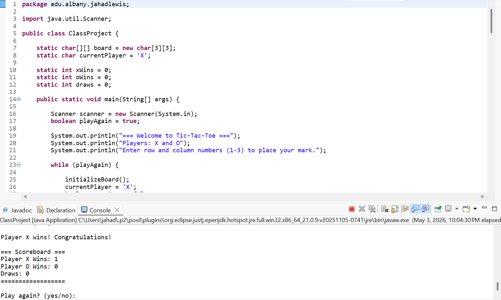

# Tic Tac Toe (Java)

## ICSI/IECE 201 Class Project

Developed by: Jahad Lewis and Eduardo J

## Description
This project is a console-based Tic Tac Toe game developed in Java. It allows two players to take turns placing X and O on a 3x3 board while checking for wins, draws, and invalid inputs. The program demonstrates core programming concepts such as input validation, control structures, and algorithmic game logic.

## Features
- Two-player mode (X and O)
- Input validation to prevent invalid or duplicate moves
- Win and draw detection
- Scoreboard tracking across multiple games

## How to Play
- Player X goes first
- Players take turns entering a row and column (1–3)
- The first player to get three in a row (horizontal, vertical, or diagonal) wins
- If all cells are filled with no winner, the game ends in a draw

## Game Preview

## How to Run
1. Compile the program
2. Run `ClassProject.java`
3. Follow the on-screen instructions

## Technologies Used
- Java
- Console-based interface

## Project Structure
- ClassProject.java: Main program file containing game logic and methods

## Test Cases
- Valid gameplay resulting in Player X win
- Valid gameplay resulting in Player O win
- Draw scenario
- Invalid input (non-numeric values)
- Invalid move (selecting an occupied cell)

## Authors
Jahad Lewis  
Eduardo J
